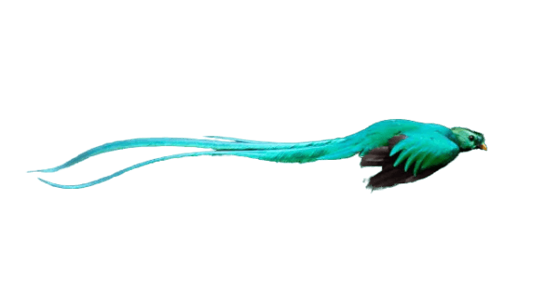

<!-- PROJECT SHIELDS -->
[![Codacy Badge][codacy-shield]][codacy-url]
[![Issues][issues-shield]][issues-url]
[![Forks][forks-shield]][forks-url]
[![Stargazers][stars-shield]][stars-url]
[![repo-size][repo-size-shield]][repo-size-url]
[![Contributors][contributors-shield]][contributors-url]
[![license][license-shield]][license-url]

<br />
<div align="center">

  <h3 align="center">Denoiser</h3>

   <a href="https://quetzal.applycreatures.com">
      
   </a>

  <p align="center">
    An audio denoiser
    <br />
    <a href="https://quetzal.applycreatures.com"><strong>See live »</strong></a>
    <br />
    <br />
    <a href="https://github.com/apply-creatures/creature-quetzal/issues">Report Bug</a>
    ::
    <a href="https://github.com/apply-creatures/creature-quetzal/issues">Request Feature</a>
  </p>
</div>

<p align="center">
OK, DOkey
</p>

<!-- TABLE OF CONTENTS -->
<details>
  <summary>Table of Contents</summary>
      <ol>
         <li>
         <a href="#about">About</a>
         <ul>
            <li><a href="#built-with">Built With</a></li>
         </ul>
         </li>
         <li>
         <a href="#getting-started">Getting Started</a>
         <ul>
            <li><a href="#prerequisites">Prerequisites</a></li>
            <li><a href="#repo">Repo</a></li>
            <li><a href="#develop">Develop</a></li>
            <li><a href="#build">Build</a></li>
            <li><a href="#deploy">deploy</a></li>
         </ul>
         </li>
         <li><a href="#roadmap">Roadmap</a></li>
         <li><a href="#contributing">Contributing</a></li>
         <li><a href="#license">License</a></li>
         <li><a href="#acknowledgments">Acknowledgments</a></li>
      </ol>
</details>

<hr/>

**TL;DR**

## 🛠 Installation & Set Up


1. Install and use the correct version of Node using [nvm](https://github.com/nvm-sh/nvm)

   ```sh
   nvm install
   ```

2. Install dependencies

   ```sh
   npm install
   ```

3. Start the development server

   ```sh
   npm run dev
   ```

## 🚀 Building and Running for Production

3. Build the production assets

   ```sh
   npm run build
   ```

4. Deploy to Fly

   ```sh
   fly deploy . # this uses the Dockerfile, there is also a fly.toml for config
   ```

<hr/>

<!-- ABOUT THE PROJECT -->

## About

A sound background remover, denoiser. It ships with a front-end with a browser based record feature and upload/drag. The front-end sends a multi part upload to the server. The server is a nodejs simpler API that upon invoking the upload endopoints:
- Invokes ffmpeg to convert from mp3 to PCM format, in /tmp/ folder
- Invokes rrnoise to denoise the PCM file, producing a filepath.denoised.pcm
- Invokes ffmpeg again with the denoised file, to convert it to mp3
- Streams the produced denoised mp3 to the request's response

The repo contains a container that sets up the binaries, ffmpeg, rrnoise by checking and building the repo, and this repo sets of file, installs npm dependencies and launches the server

the html file is served by the server, so that this project is self contained, but the API can be used on its own, integrating a UI form as part of another webapp.

Of course, nothing is perfect, but I'm trying to make these web pages a pleasure to navigate and  component easy to setup locally and deploy. If I failed in accomplishing that, shoot me a message.

<p align="right">(<a href="#readme-top">back to top</a>)</p>

### Built With

- [node.js](https://nodejs.org/) - of course
- [typescript](https://www.typescriptlang.org/) - for types on the front and backend
- [rrnoise](https://github.com/xiph/rnnoise) - Recurrent neural network for audio noise reduction
- [ffmpeg](https://ffmpeg.org/) - to convert audio in other formats

### Also using

- [openapi](https://www.openapis.org/) 
- and [swagger-ui](https://quetzal.applycreatures.com/api/index.html) - for beautiful API spec
- and [Redoc](https://redocly.com/) - for beautiful docs

<hr/>

<!-- GETTING STARTED -->

## Getting Started

### Prerequisites

- you need [Git](https://git-scm.com/) installed
- and [nodejs](https://nodejs.org/) of course

### Repo

```bash
$ git clone https://github.com/apply-creatures/creature-quetzal.git
```

Navigate to the repo root's folder then install dependencies

```bash
$ cd ./creature-quetzal && npm install
```

### Develop

```bash
$ npm run develop # may need to build first, not sure
```

### Build

This command will build everything for production deployment:

```bash
$ npm run build
```

It generates the files for the entire page.

### Deploy

```bash
$ fly deploy
```

<p align="right">(<a href="#readme-top">back to top</a>)</p>

### Customize

- yea go for it

<hr/>

## Roadmap

- [x] get some model to denoise nosie
- [x] get ffmpeg to convert for denoiser to sink in
- [x] get some nodejs API up and running
- [x] get and test all that with some UI
- [x] wipe that /tmp/ folder before storage and privacy gets angry
- [x] add browser recording feature on top of upload
- [x] integrate with some real UI
- [x] performance improvements
- [x] some docker file for convenience and deployments
- [x] deploy that
- [] denoise in real time?
- [] test with better models?

<hr/>

## Contributing

Contributions are what make the open source community such an amazing place to learn, inspire, and create. Any contributions you make are **greatly appreciated**.

If you have a suggestion that would make this better, please fork the repo and create a pull request. You can also simply open an issue with the tag "enhancement".
Don't forget to give the project a star! Thanks again!

1. fork the Project
2. create your Feature Branch (`git checkout -b feature/some-feature`)
3. commit your Changes (`git commit -m 'Add some feature'`)
4. push to the Branch (`git push origin feature/some-feature`)
5. open a Pull Request

<hr/>

## License

[![license][license-shield]][license-url]


see [license](./licenses/BSL.txt)


[license-url]: http://creativecommons.org/licenses/bsd-3-clause
[cc-by-nc-sa-shield]: hhttps://img.shields.io/github/license/apply-creatures/creature-quetzal?style=for-the-badge

If you too produce work and publish it out there, it's clearer to choose a [license](https://choosealicense.com).

<p align="right">(<a href="#readme-top">back to top</a>)</p>

<hr/>

## Acknowledgments

It would never end. I've done this work not just off dozens of other people's open source work, but hundreds thousands or maybe millions.
Special kudo to the gatsby team that made such an easy tool to build static websites, the pipeline and community is awesome.

Whoever made markdown, although that was probably inspired by some other cool markups languages, thank you.

the js and communities, millions of developers made the npm ecosystem so rich one can build virtually anything with node.

If you decide to re-use this repo to build your own, go ahead. No need to credit or link back to this repo/site. Although it would be appreciated.

**Don't re-republish this thing pretty much as is though**, it is lame, and shameless.
Tweak the look and feel, make it your own. Make it so that I wouldn't come across your stuff and think that it is mine. So that nobody comes across your claims and somehow finds out it's a louzy copy of someone else lacking added value and personalisation.

[contributors-shield]: https://img.shields.io/github/contributors/apply-creatures/creature-quetzal.svg?style=for-the-badge
[contributors-url]: https://github.com/apply-creatures/creature-quetzal/graphs/contributors
[forks-shield]: https://img.shields.io/github/forks/apply-creatures/creature-quetzal.svg?style=for-the-badge
[forks-url]: https://github.com/apply-creatures/creature-quetzal/network/members
[stars-shield]: https://img.shields.io/github/stars/apply-creatures/creature-quetzal.svg?style=for-the-badge
[stars-url]: https://github.com/apply-creatures/creature-quetzal/stargazers
[issues-shield]: https://img.shields.io/github/issues/apply-creatures/creature-quetzal.svg?style=for-the-badge
[issues-url]: https://github.com/apply-creatures/creature-quetzal/issues
[license-shield]: https://img.shields.io/github/license/apply-creatures/creature-quetzal.svg?style=for-the-badge
[license-url]: https://github.com/apply-creatures/creature-quetzal/blob/main/LICENSE
[repo-size-shield]: https://img.shields.io/github/repo-size/apply-creatures/creature-quetzal?style=for-the-badge
[repo-size-url]: https://github.com/apply-creatures/creature-quetzal/archive/refs/heads/main.zip
[product-screenshot]: images/logo.png
